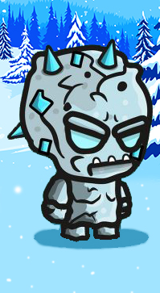

# IRONFLAG BATTLE

Long time ago a war of pride started in Ironhack between the coders that attended to the part-time web developer course and those who attend to the full-time course. The armies were formed by three different type of soldiers:

- **Soldiers from the forests of planet Earth**: This soldiers, also know as **Front-end developers**, are very skilled when they have to design uniforms, maps, structure of weapons... everything that an army needs to go to war with the most comfortable equipment.

- **Soldiers from the artic places of planet Earth**: This soldier, also known as **Back-end developers**, are rough and cold people, that are incredibly skilled giving functionality to the designs made by the people of the forest.

- **Soldiers from Mars**: Finally there is are rare, but amazing type of soldier the **Full-stack developer**, that has been able to master the skills of all the inhabitants of planet Earth and can give a deeper vision on the combination of design and functionality.

        

This war was cold and brutal, many coders in both sides were burning their eyes in front of a screen. Most of them would end blind and useless to their band. For this reason, the leaders of each side, got together and decided that the best way to solve their problems, will be a competition, where each side will develop a combatcraft that will stand for their side and show who should be the real ruler.

## Rules of combat

1. The winner would be the best out of 5 fights that will prove the ability of each pilot and the best engineering of their crafts.

2. A point will be score every time a craft can bring the opponet's flag to their own base. (But carefull we are in Ironhack, therefore the flags are made of Iron and carry them will make your craft slower).

3. There are no more rules just **FIGHT** and **WIN**.

### Battlefields

The war could take place in three different places:

- Forest of planet Earth
- Artic in planet Earth
- Mars colonies

        

### Stages

- Stage 1: Just brutal battle betweent the two pilots!

- Stage 2: Carefull now you will have to find the best route to get to the enemy base and return safely.

- Stage 3: Oh no! Who put that there? This stage will have dangerous objects that can kill you just by touch.

- Stage 4: What is this? the battlefield is into a rotor that makes movement much more complicated.

- Stage 5: Both armies are so skilled developers that they hacked into the enemy pilot craft and now controls are reversed.

## Controls

The pilot of the Part-time army will have the following controls:

- UP - W
- DOWN - S
- LEFT - A
- RIGHT - D
- FIRE - V 

The pilot of the Full-time army will have the following controls:

- UP - Arrow up
- DOWN - Arrow down
- LEFT - Arrow left
- RIGHT - Arrow Right
- FIRE - P

